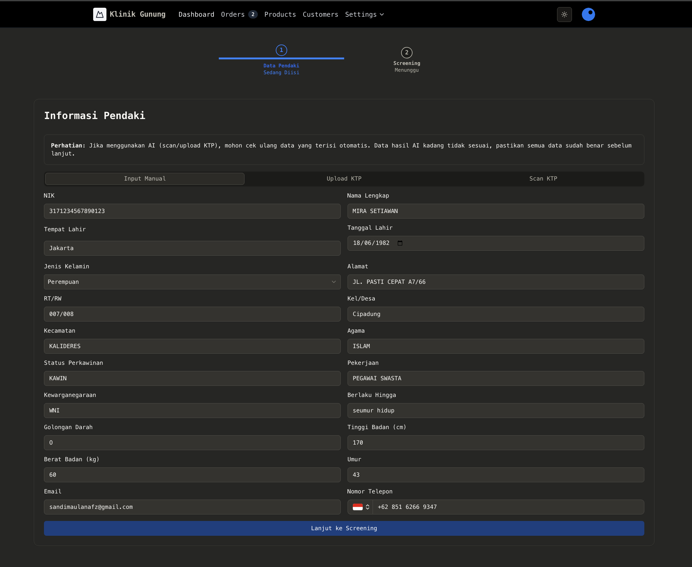
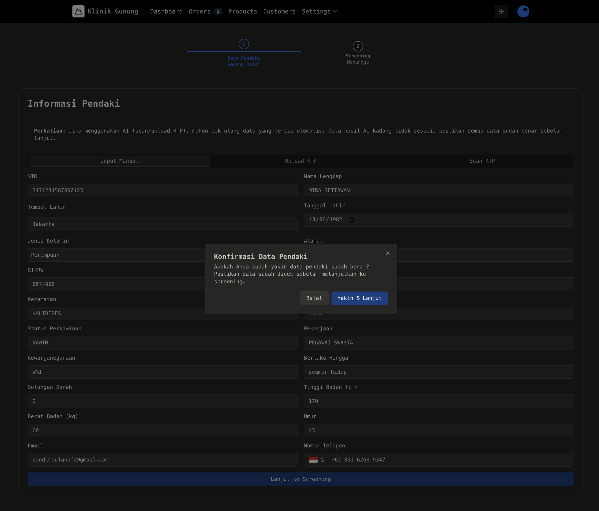
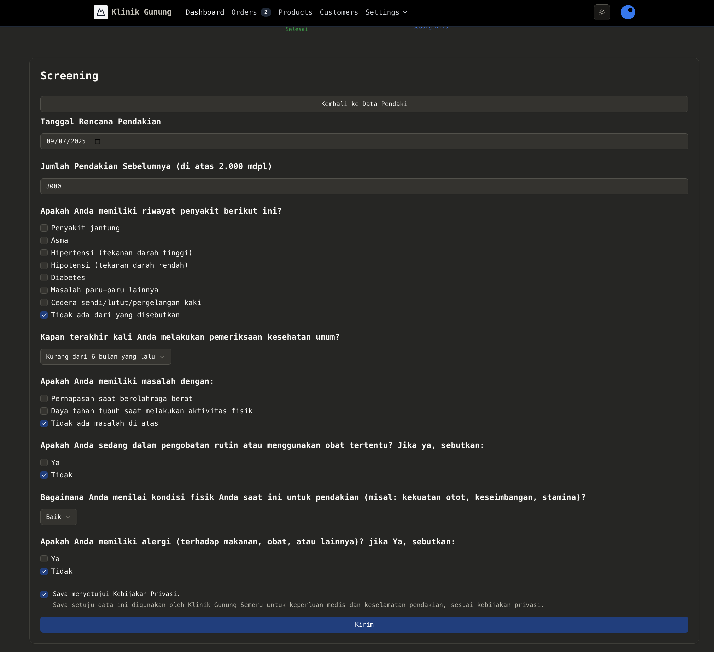
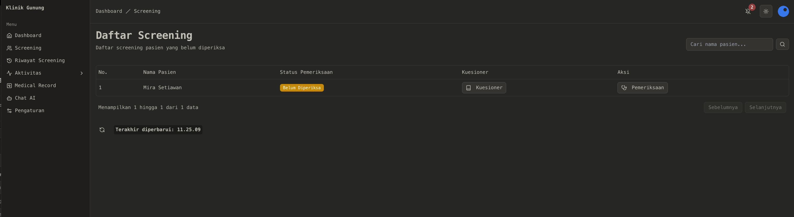
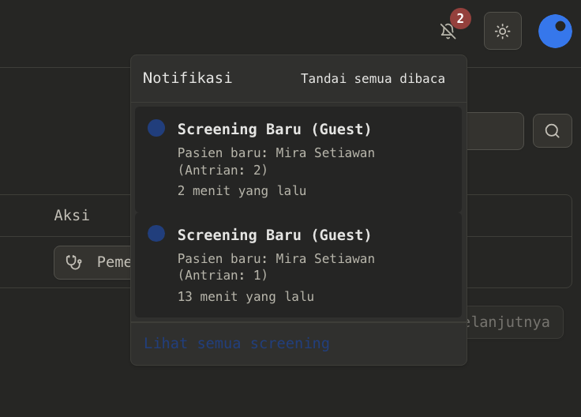

# Test Screening Tanpa Pendampingan Dan Konsultasi

## 1. Pasien Melakukan Screening

Pasien mengisi data pribadi yang dilakukan oleh admin kasir.

<figure><figcaption></figcaption></figure>

Sebelum dilakukan submit data client, admin cashier harus memastikan kesesuaian data pribadi client.

<figure><figcaption></figcaption></figure>

Setelah pengisian data pribadi pasien, kasir mulai mengisi kuesioner.

<figure><figcaption></figcaption></figure>

Setelah mengiri kuesioner dan mengirim, pasien di arahkan ke pemeriksaan fisik atau ke perawat

## 2. Pemeriksaan Fisik

Perawat atau paramedis akan melakukan pemeriksaan fisik sesuai dengan notif yang muncul di dashboar atau pada menu daftar screening.

<figure><figcaption></figcaption></figure>

<figure><figcaption></figcaption></figure>

Perawat atau paramedis akan memastikan terkait data quisioner tentang kesehatan pendakian client. (Hijau :normal, Merah :bermasalah)

<figure><figcaption></figcaption></figure>

Selanjutnya perawat akan mulai melakukan pemeriksaan fisik

<figure><figcaption></figcaption></figure>

Setelah perawat melakukan pemeriksaan fisik makan akan ada sertifikat yang print otomatis, atau bisa print melalui riwayat pemeriksaan.

<figure><figcaption></figcaption></figure>

<figure><figcaption></figcaption></figure>

## 3. Pembayaran

Setelah pemeriksaan fisik pasien akan di arahkan ke admin kasir untuk pembayaran.

Pada admin kasir ada list pembayaran screening yang sudah melakukan pemeriksaan fisik dan akan ada notifikasi masuk jika ada pasien sudah melakukan pemeriksaan fisik.

<figure><figcaption></figcaption></figure>

Pasien memulai pembayaran dan kasir mulai melakukan pembayaran

<figure><figcaption></figcaption></figure>

Kasir memilih metode pembayaran dan jenis pelayanan. Pasien juga mampu membeli produk dan obat. jika pasien membeli obat dan produk itu akan tercatat di riwayat transaksi

<figure><figcaption></figcaption></figure>

<figure><figcaption></figcaption></figure>

Setelah pembayaran cetak nota

<figure><figcaption></figcaption></figure>

<figure><figcaption></figcaption></figure>

Riwayat Transaksi produk dan obat

<figure><figcaption></figcaption></figure>
